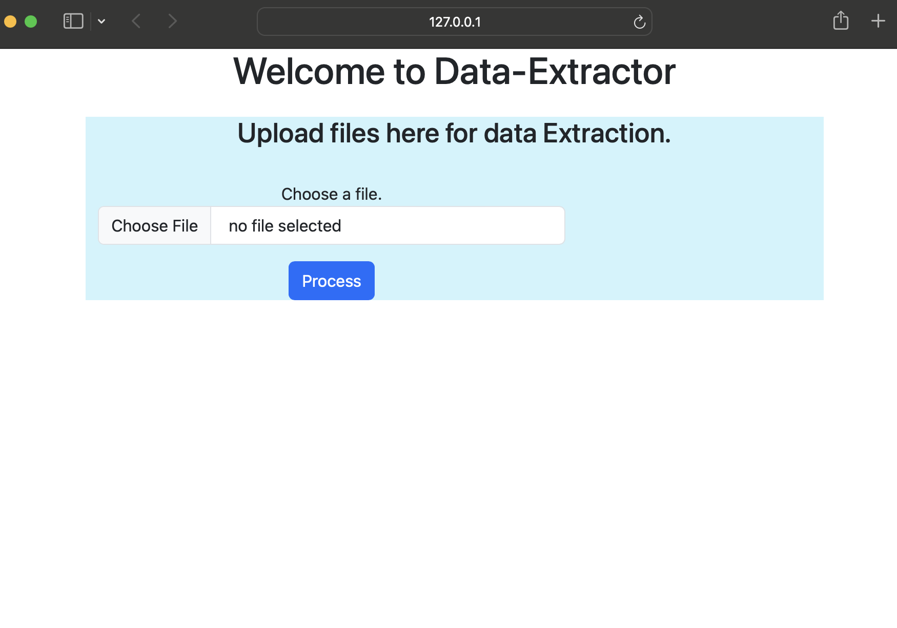
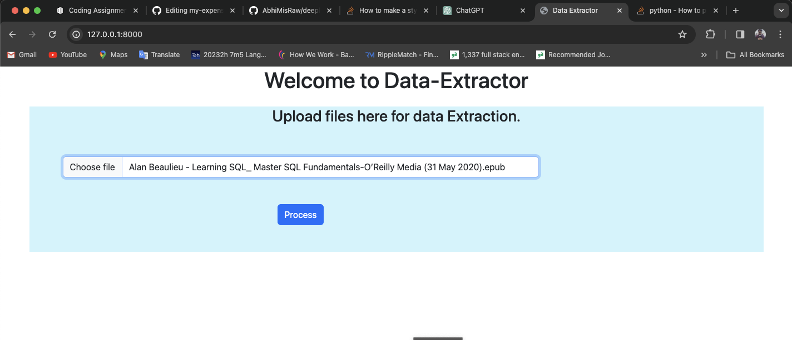
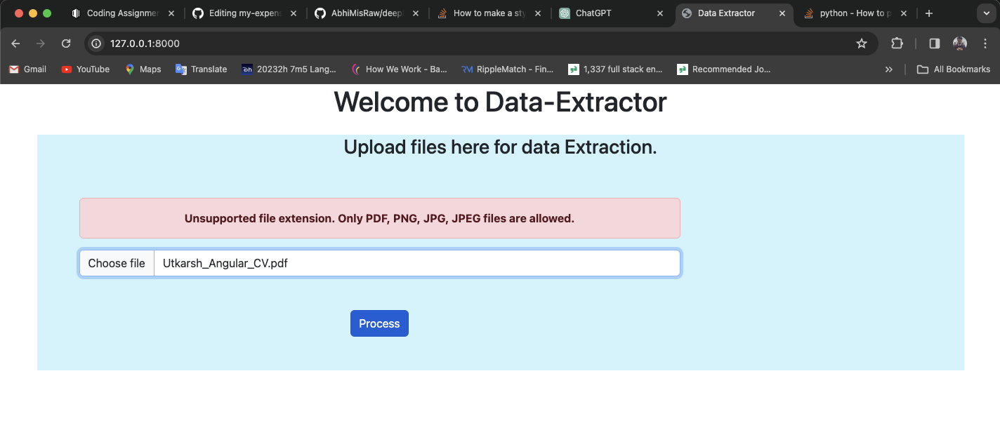
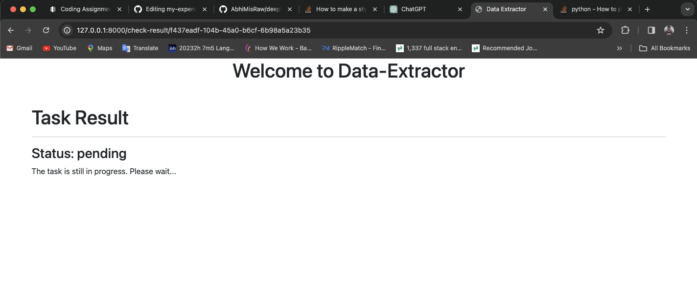
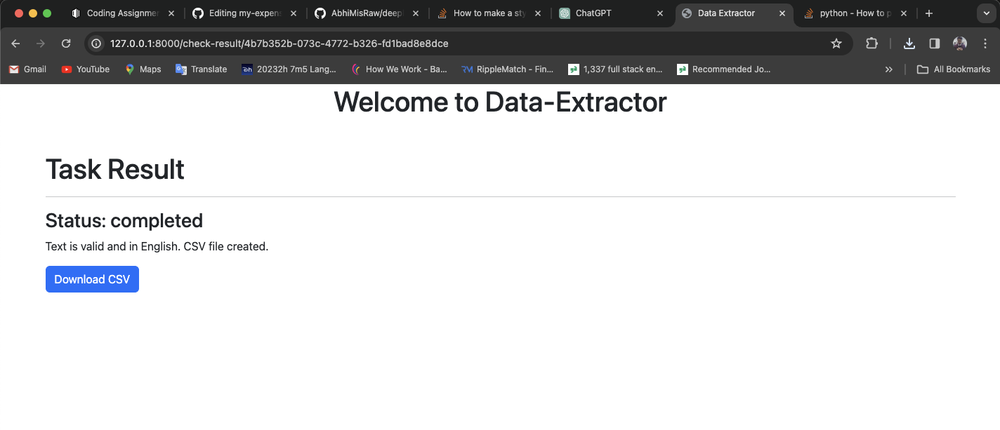

# Deeplogic Assignment


## Feature of DataExtraction App

- user can upload files in pdf or any image format.
- user can watch the processing status and download the `csv` file if It's processed successfully.

> [!IMPORTANT]
> For running `script`  or django application, First install all the library mentioned in `requirements.txt` file inside `dataExtractor` directory.

### Task 1 
  
- script for fetching data from picture or pdf is inside `script` folder.
- This script is not fully functional however I've tried implement (mimic) this functionality.
- I've used `pytessaract` open-source library wrapper arround `Google's Tesseract OCR Engine`.
 

### Task 2
- Web application is developed using Django and celery
- All the files for Django application is inside `dataExtractor` dir.
- This is my first time using `Celery` so I may not have followed best practices for integrating the `celery` in django application.


> [!NOTE]
> __Assumption__ : Task of extracting data from image or pdf file uploaded by user will surely take some time (impossible in constant time) so running this task on backgroud would be great idea because in the main process (where Django server is running) will be blocked because of data extraction process. and user will not be able to get any response from the django. 

## Requirement

- Python 3.X and virtual environment package
- redis ( for message broker )
- Google's Tessaract Executable
- Web browser

---

## How to run Locally

1. make a directory and go to the directory
2. make a virtual environment <br>
   <b>a.</b> for windows
   ```bash
     python -m venv dev-env
   ```
   <b>b.</b> for unix & linux system
   ```bash
     python3 -m venv dev-env
   ```
3. Create the directory and inside the directory clone the project.
   ```bash
     git clone https://github.com/AbhiMisRaw/deeplogic-assignment
   ```
4. Enable virtual environment<br>
   <b>a.</b> for windows
   ```bash
     dev-env\Scripts\activate
   ```
   <b>b.</b> for unix & linux system
   ```bash
     source dev-env/bin/activate
   ```
5. Go to the cloned project directory
   ```bash
     cd dataExtractor
   ```
6. Install dependencies

   ```bash
     pip install -r requirements.txt
   ```
7. Run migrations
   ```bash
     python manage.py makemigrations
     python manage.py migrate
   ```
8. configure `pytesseract` by placing path of `Tesseracrt` executable inside `celery.py`.
   ```python
   pytesseract.pytesseract.tesseract_cmd = r'path/to/executable'
   ```
9. Recheck the `celery` cofiguration inside `settings.py`. I've used redis server for storing celery task state.
```python
CELERY_TIMEZONE = 'Asia/Kolkata'
CELERY_BROKER_URL = 'redis://127.0.0.1:6379/0'
CELERY_RESULT_BACKEND = 'redis://127.0.0.1:6379/0'
```

10.  Start the server
    ```bash
      python manage.py runserver
    ```


----
## Screenshot
1. File Upload View


2. Error When user upload unsupported file.




3. Uploading correct file and processing started  


4. If processed successfully then only user can download the csv.
 